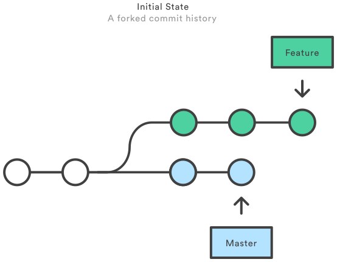
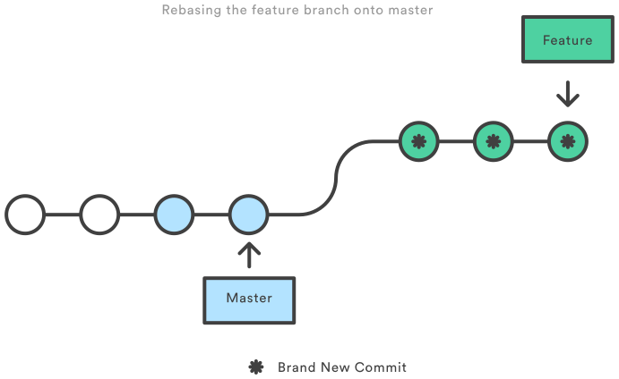
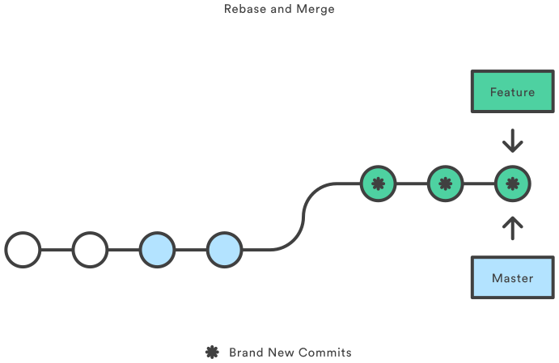

### What is it?
Rebasing is the process of moving a whole branch to a new base commit. 
Git takes your changes, and "replays" them onto the new base commit.
This creates a brand new commit for each commit in the original branch. 
As such, **your history is rewritten when you rebase**.

It's like saying "add my changes to what has already been done".

](../fig/git-rebase.svg)

### How's that different to merging?
Imagine you create a new feature branch to work in, and meanwhile there have been
commits added to the `master` branch, as shown below.



You've finished working on the feature, and
you want to incorporate your changes from the `feature` branch into the `master` branch.
You could merge directly or rebase then merge. We have already encountered merging, and it looks like this:


The main reason you might want to rebase is to maintain a linear project history. 
In the example above, if you merge directly (recall that there are new commits on 
both the `master` branch and `feature` branch), you have a 3-way merge
(common ancestor, HEAD and MERGE_HEAD) and a merge commit results. 
Note that you get a merge commit whether or not there are any merge conflicts.

If you rebase, your commits from the `feature` branch are replayed onto `master`,
creating brand new commits in the process.
If there are any merge conflicts, you are prompted to resolve these. 



After rebasing, you can then perform a fast-forward merge into `master` i.e. without
an extra merge commit at the end, so you have a nice clean linear history.



### Why would I consider rebasing?
`Rebase` and `merge` solve the same problem: integrating commits from one branch into another.
Which method you use is largely personal preference.

Some reasons to consider rebasing:
- To give a linear project history, which is easier to follow
	- This makes using `git log`, and `git bisect` easier
- To integrate upstream changes into your local repository, without creating any merge commits
- To keep a feature branch up to date with master, without polluting your feature branch with extraneous merge commits
- Makes pull requests easier to manage (because you've already resolved any merge conflicts while rebasing)
- To tidy up a feature branch before merging into master (requires interactive rebase)


> ## Interactive rebasing
> `git rebase -i` will open an interactive rebasing session. This provides an opportunity
> to edit, delete, combine, and reorder individual commits as they are moved onto the new
> base commit. This can be useful for cleaning up history before sharing it with others.
{: .callout}

### A worked example using `git rebase <base>` 

We'll create a feature branch, and rebase it onto master before merging.

Let's start first with checking out our `master` branch:

```
$ git checkout master
```
{: .bash}
	
Now create and checkout a new branch.

```
$ git checkout -b results
```
{: .bash}
	
Add a results section to the paper with a couple of lines to outline the findings.
Commit the changes you made.

```
$ gedit journal.md				# Add results section
$ git add journal.md
$ git commit					# "Write results section"
```
{: .bash}

Checkout the `master` branch and write some conclusions. Commit them.

```
$ git checkout master				# Checkout master branch
$ gedit journal.md				# Add conclusions section
$ git add journal.md
$ git commit					# "Write conclusions section"
```
{: .bash}
At this point we can view a graph of project history,
and see where the `results` branch splits off from the `master` branch:
```
$ git log --graph --all --oneline --decorate	# View project history before rebasing
```
{: .bash}
```
* c9aa3ad (HEAD -> master)  Write conclusion
| * e26fa5e (results) Write results section
|/
* 9a7fd0b Add methodology section and include reference
*   39cc80d Merge branch 'paperwjohn'

```
{: .output}

Now check out our `results` branch again and rebase:

```
$ git checkout results				# Check out the results branch again
$ git rebase master				# Rebase onto master
```
{: .bash}

Depending what changes we have made, there may be conflicts we have to fix in order to rebase.
If this is the case, Git will let us know, and give some instructions on how to proceed.
The process for fixing conflicts is the same as before:

```
$ gedit journal.md      			# Manually fix conficts in affected file(s)
$ git add                			# Mark file as resolved
$ git rebase --continue  			# Continue to rebase
```
{: .bash}

Let's now visualise our project history again, having rebased `results` onto `master`,
and observe that we now have a linear project history.

```
$ git log --graph --all --oneline --decorate	# View project history after rebasing
```
{: .bash}

```
* 7e52408 (HEAD -> results) Write results section
* c9aa3ad (master) Write conclusion
* 9a7fd0b Add methodology section and include reference
*   39cc80d Merge branch 'paperwjohn'
```
{:  .output}

See how rebasing created a new commit and put it on
top of the commit pointed at by `master`.
If we switch back to the `master` branch, we can now merge the rebased `results` branch into
master and a linear history results.

```
$ git checkout master   			# Switch branch to master
$ git merge results     			# Merge results branch into master
$ git log --graph --oneline --decorate		# View project history after merging rebased branch
```
{: .bash}

```
* 7e52408 (HEAD -> master, results) Write results section
* c9aa3ad Write conclusion
* 9a7fd0b Add methodology section and include reference
*   39cc80d Merge branch 'paperwjohn'
```
{: .output}

This [online tutorial](https://www.atlassian.com/git/tutorials/rewriting-history/git-rebase)
gives a good illustration of what happens during rebasing.

> ## Warning: the perils of rebasing 
>
> The main rule is: **do not rebase branches shared with other contributors**.
> Rebasing changes history and as with practically any Git command which changes
> history, it should be used with care. 
> 
> The branches that are pushed to remote repositories should always be merged.
> For your local branches that you never share, you may use rebasing. Rebasing is
> convenient if you want to keep a clean history. It also helps to avoid
> conflicts in the long run. But again, it is considered a better practice to use
> merge and deal with conflicts rather than mess up shared branches using rebase.
{: .callout}
